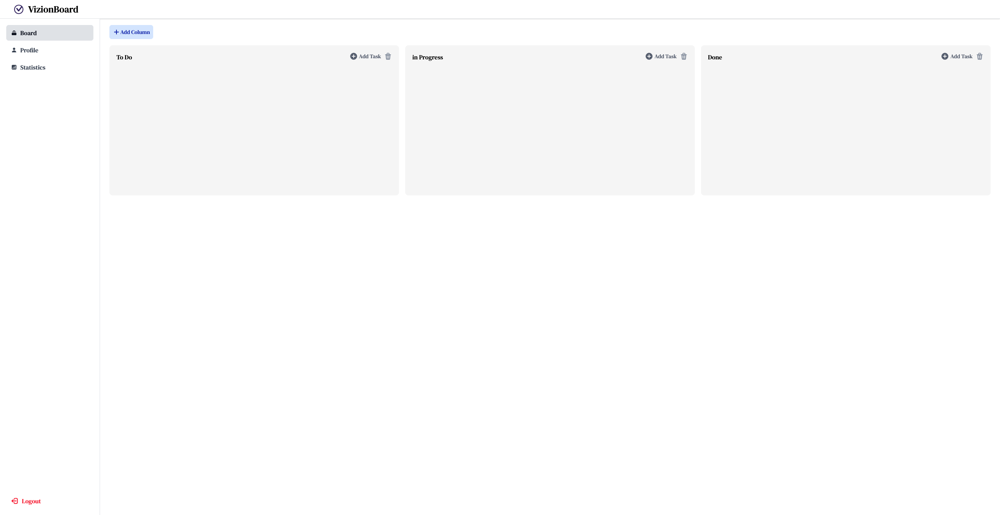
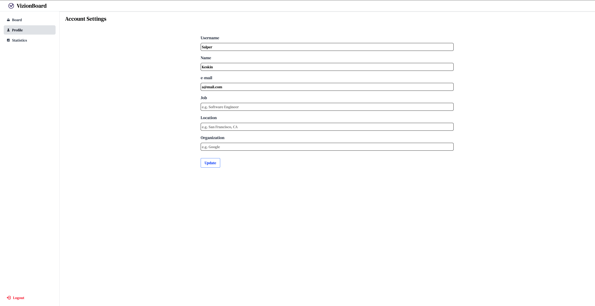
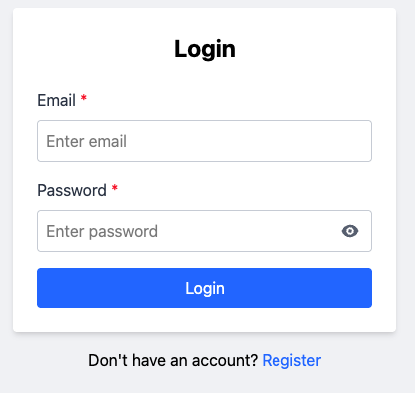
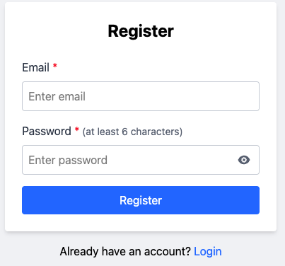

# VizionBoard - Full Stack SaaS Dashboard

VizionBoard, proje yönetimi ve iş akışı takibi için geliştirilmiş; modern, ölçeklenebilir ve yüksek performanslı bir SaaS platformudur. **Monorepo** mimarisi kullanılarak geliştirilen bu proje, **Frontend (React 19)** ve **Backend (NestJS 11)** uygulamalarını tek bir çatı altında toplar ve tip güvenliğini (Type Safety) uçtan uca sağlar.

## 🚀 Öne Çıkan Özellikler

* **Mimari:** TurboRepo ve pnpm workspaces ile yönetilen Monorepo yapısı.
* **Tam Tip Güvenliği:** Frontend ve Backend arasında paylaşılan Zod şemaları (`packages/validation`).
* **Kanban Panosu:** `@hello-pangea/dnd` ile sürükle-bırak (Drag & Drop) görev yönetimi.
* **Kimlik Doğrulama:** HTTP-Only Cookie tabanlı güvenli JWT Authentication (Passport & Guards).
* **Modern UI:** Tailwind CSS v4 ve React 19 ile yüksek performanslı arayüz.
* **State Management:** Redux Toolkit ile global durum yönetimi.
* **Veritabanı Yönetimi:** Prisma ORM ile güvenilir veri modelleme.

## 🛠️ Teknoloji Yığını (Tech Stack)

### 🏗️ Monorepo & Araçlar
| Teknoloji | Açıklama |
| :--- | :--- |
| **TurboRepo** | Yüksek performanslı build sistemi |
| **pnpm** | Hızlı ve verimli paket yöneticisi |
| **TypeScript** | Statik tip kontrolü |
| **Zod** | Şema validasyonu (Frontend & Backend ortak) |

### 💻 Frontend (Client)
| Teknoloji | Sürüm / Açıklama |
| :--- | :--- |
| **React** | v19 (En güncel sürüm) |
| **Vite** | Hızlı geliştirme ortamı |
| **Redux Toolkit** | State yönetimi (`store.ts`, `slices`) |
| **Tailwind CSS** | v4 (Modern stilizasyon) |
| **React Hook Form** | Performanslı form yönetimi |
| **@hello-pangea/dnd** | Kanban sürükle-bırak altyapısı |
| **React Router** | v7 (Client-side routing) |

### ⚙️ Backend (Server)
| Teknoloji | Sürüm / Açıklama |
| :--- | :--- |
| **NestJS** | v11 (Modüler backend framework) |
| **Prisma ORM** | Veritabanı etkileşimi |
| **Passport-JWT** | Token tabanlı yetkilendirme |
| **Bcryptjs** | Şifre hashleme |
| **Cookie-Parser** | Güvenli cookie yönetimi |

## 📂 Proje Yapısı

```bash
vizionboard/
├── apps/
│   ├── frontend/   # React 19 + Vite uygulaması
│   └── backend/    # NestJS 11 API servisi
├── packages/
│   └── validation/ # Paylaşılan Zod şemaları (Auth, Board, Task)
├── package.json    # Root pnpm workspace konfigürasyonu
└── turbo.json      # Pipeline ayarları
```

## 📦 Kurulum ve Çalıştırma
Bu projeyi yerel ortamınızda çalıştırmak için aşağıdaki adımları izleyin:

- Gereksinimler
- Node.js (LTS sürümü önerilir)
- pnpm (npm install -g pnpm)

Veritabanı (PostgreSQL veya Docker üzerinden)

## Projeyi Klonlayın ve Paketleri Yükleyin

```bash
git clone [https://github.com/semihalperKeskin/saas-dashboard.git](https://github.com/semihalperKeskin/saas-dashboard.git)
cd saas-dashboard

# Bağımlılıkları yükleyin (Workspace olduğu için kök dizinde çalıştırın)
pnpm install
```

## Çevre Değişkenlerini (Env) Ayarlayın

Backend klasöründe .env dosyasını oluşturun:

```bash
cd apps/backend
cp .env.example .env
# .env dosyasındaki DATABASE_URL ve JWT_SECRET alanlarını doldurun.
```

## Veritabanını Hazırlayın (Prisma)

```bash
# Kök dizinden veya apps/backend dizininden:
cd apps/backend
pnpm prisma:generate  # Prisma Client'ı oluştur
pnpm prisma:migrate   # Veritabanı tablolarını oluştur
```

## Uygulamayı Başlatın (Development Mode)

TurboRepo sayesinde hem frontend hem backend tek komutla paralel çalışır:

```bash
# Kök dizinde (root)
pnpm dev
```

- Frontend: http://localhost:5173

- Backend API: http://localhost:3000

## 📸 Ekran Görüntüleri

Uygulamanın arayüzünden bazı kareler:

### 1. Dashboard (Ana Sayfa)
Görevlerin yönetildiği ana Kanban panosu.


### 2. Profil Ayarları
Kullanıcı bilgilerinin güncellendiği ekran.


### 3. Giriş ve Kayıt (Authentication)
Kullanıcıların sisteme güvenli bir şekilde giriş yapmasını sağlayan ekranlar.

| Login Ekranı | Register Ekranı |
| :---: | :---: |
|  |  |